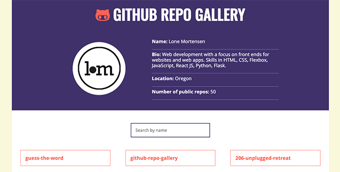

# GitHub Repo Gallery
The interactive GitHub Repo Gallery utilizes JavaScript and an API to fetch and display public GitHub portfolios. Built with JavaScript and the GitHub REST API.

## About
The GitHub Repo Gallery lets users view and search for public repos and click on individual repos to access additional details and links. 

Using the GitHub REST API to pull data from a GitHub account, the gallery automatically updates and displays the most current repo versions.

## Project Background
I built the GitHub Repo Gallery project as part of Skillcrush’s “JavaScript Fundamentals” course. 

The project utilizes JavaScript and four separate calls to the GitHub REST API to fetch user and repo data and populate the gallery. 

A dynamic search function that takes user input to search repo names enables further interaction with the user.

During this project, I practiced:

- Accessing and fetching JSON data from the GitHub API using endpoints, template literals, and parameters. 

- Working with the DOM to add HTML and display the fetched user and repo data.

- Using a click event listener on an unordered list of repos and a conditional statement paired with the matches() method to check if the target matches a specific element — in this case the name of the repo — instead of applying event listeners to every repo element.     

- Fetching JSON data on programming languages used in each repo and applying a for loop and the push() method to add the languages to an array for later display. 

- Using an input event listener to capture user text input in a search box so only repos with a title that includes the value inputted by the user are displayed. 

## Built With 
- JavaScript
- REST API
- HTML5 
- CSS3 

## Launch
[See the live version of the GitHub Repo Gallery here.](https://lonemortensen.github.io/github-repo-gallery/)

## Acknowledgements
**Skillcrush** - I coded the JavaScript file for the GitHub Repo Gallery with support and guidance from Skillcrush. The project’s HTML and CSS files were provided by Skillcrush.
